# Little Lemon Restaurant Booking Web App

A modern, responsive web application for the Little Lemon restaurant that allows customers to book tables online. Built with React and designed with accessibility and mobile-first principles.

## 🍋 About Little Lemon

Little Lemon is a family-owned Mediterranean restaurant, focused on traditional recipes served with a modern twist. Based in Chicago, Illinois, the restaurant offers authentic Mediterranean cuisine with a contemporary approach.

## ✨ Features

- **🏠 Complete Restaurant Website**: Home, Specials, Reviews, About, and Reservations sections
- **📱 Responsive Design**: Optimized for mobile, tablet, and desktop devices
- **♿ Accessibility**: WCAG 2.1 compliant with proper ARIA labels and semantic HTML
- **✅ Form Validation**: Comprehensive client-side validation with real-time feedback
- **🎨 Modern UI/UX**: Clean, intuitive interface following Little Lemon's brand guidelines
- **🧪 Unit Tests**: Comprehensive test coverage for all components (26 tests passing)
- **🛡️ Security**: Updated dependencies with security audit fixes
- **🖼️ Real Images**: High-quality restaurant and food photography
- **📞 Contact Information**: Complete restaurant details and opening hours

## 📋 Table of Contents

- [Installation](#installation)
- [Usage](#usage)
- [Website Sections](#website-sections)
- [Testing](#testing)
- [Accessibility](#accessibility)
- [Responsive Design](#responsive-design)
- [Project Structure](#project-structure)
- [Screenshots](#screenshots)
- [Contributing](#contributing)
- [License](#license)

## 🚀 Installation

### Prerequisites

- Node.js (version 14 or higher)
- npm or yarn package manager

### Setup Instructions

1. **Clone the repository**
   ```bash
   git clone https://github.com/DurveshChavan/little_lemon.git
   cd Little-Lemon
   ```

2. **Install dependencies**
   ```bash
   npm install
   ```

3. **Fix security vulnerabilities**
   ```bash
   npm audit fix --force
   ```

4. **Start the development server**
   ```bash
   npm start
   ```

5. **Open your browser**
   Navigate to `http://localhost:3000` to view the application.

## 🎯 Usage

### Website Navigation

The Little Lemon website includes five main sections:

1. **🏠 Home** - Hero section with restaurant introduction and call-to-action
2. **🍽️ Specials** - Weekly menu items featuring Greek Salad, Bruschetta, and Lemon Dessert
3. **⭐ Reviews** - Customer testimonials with ratings and feedback
4. **ℹ️ About** - Restaurant story, features, and history
5. **📅 Reservations** - Online booking form with validation

### Making a Reservation

1. **Navigate to the booking form** - Scroll down to the "Reserve a Table" section
2. **Fill in your details**:
   - First Name and Last Name (required)
   - Email address (required)
   - Phone number (required)
   - Preferred date (required, cannot be in the past)
   - Preferred time (required, between 11:00 AM - 10:00 PM)
   - Number of guests (required, 1-10 guests)
   - Occasion (required)
   - Special requests (optional)
3. **Submit the form** - Click "Reserve Table" to confirm your reservation

### Form Validation

The form includes comprehensive validation:
- **Required fields**: All mandatory fields must be completed
- **Email format**: Valid email address required
- **Phone number**: Minimum 10 digits required
- **Date restrictions**: Cannot book in the past or more than 30 days ahead
- **Time restrictions**: Reservations available 11:00 AM - 10:00 PM
- **Guest limits**: 1-10 guests per reservation

## 🏠 Website Sections

### Home Section
- Restaurant branding and introduction
- Call-to-action button for reservations
- Hero image showcasing the restaurant interior

### Specials Section
- Weekly featured menu items
- High-quality food photography
- Pricing and descriptions
- Order buttons for each item

### Reviews Section
- Customer testimonials with star ratings
- Customer avatars and names
- Authentic feedback and reviews

### About Section
- Restaurant story and history
- Feature highlights (Traditional Recipes, Fresh Ingredients, Expert Chefs)
- Restaurant interior photography
- Family-owned since 1995

### Reservations Section
- Comprehensive booking form
- Real-time validation
- Available time slots (11:00 AM - 10:00 PM)
- Guest count options (1-10 guests)

## 🧪 Testing

### Running Tests

```bash
# Run all tests
npm test

# Run tests with coverage
npm test -- --coverage

# Run tests in watch mode
npm test -- --watch

# Run tests without watch mode
npm test -- --watchAll=false
```

### Test Coverage

The project includes comprehensive unit tests for:
- **✅ 26 Tests Passing** - All tests are currently passing
- **✅ 4 Test Suites** - Header, Hero, BookingForm, and Footer components
- **✅ Component rendering and structure** - Ensures all components render correctly
- **✅ Form validation logic** - Tests all validation rules and error handling
- **✅ User interactions** - Tests form submission and user input
- **✅ Accessibility features** - Tests ARIA labels and semantic HTML
- **✅ Error handling** - Tests error states and edge cases

### Test Results
```
Test Suites: 4 passed, 4 total
Tests:       26 passed, 26 total
Snapshots:   0 total
Time:        7.194 s
```

## Accessibility

This application follows WCAG 2.1 guidelines and includes:

- **Semantic HTML**: Proper use of headings, landmarks, and form elements
- **ARIA Labels**: Descriptive labels for screen readers
- **Keyboard Navigation**: Full keyboard accessibility
- **Focus Management**: Clear focus indicators and logical tab order
- **Color Contrast**: Sufficient contrast ratios for text and interactive elements
- **Screen Reader Support**: Compatible with assistive technologies

### Accessibility Features

- Form fields have proper labels and descriptions
- Error messages are announced to screen readers
- Navigation is keyboard accessible
- Color is not the only means of conveying information
- Interactive elements have sufficient touch targets (44px minimum)

## Responsive Design

The application is fully responsive and optimized for:

- **Mobile devices** (320px - 768px)
- **Tablets** (768px - 1024px)
- **Desktop** (1024px+)

### Responsive Features

- **Flexible Grid Layout**: Adapts to different screen sizes
- **Touch-Friendly Interface**: Large buttons and touch targets
- **Readable Typography**: Scalable text that remains legible
- **Optimized Images**: Responsive images with proper sizing
- **Mobile Navigation**: Collapsible navigation for smaller screens

## 📁 Project Structure

```
src/
├── components/
│   ├── Header.js              # Navigation header with mobile menu
│   ├── Hero.js                # Hero section with restaurant intro
│   ├── Specials.js            # Weekly specials menu items
│   ├── Testimonials.js        # Customer reviews and ratings
│   ├── About.js               # Restaurant story and features
│   ├── BookingForm.js         # Main booking form with validation
│   ├── Footer.js              # Footer with hours and links
│   └── __tests__/             # Component tests
│       ├── Header.test.js     # Header component tests
│       ├── Hero.test.js       # Hero component tests
│       ├── BookingForm.test.js # BookingForm tests (26 tests)
│       └── Footer.test.js     # Footer component tests
├── assets/
│   ├── images/                # Restaurant and food images
│   │   ├── hero-restaurant.png
│   │   ├── greek-salad.png
│   │   ├── bruschetta.png
│   │   ├── lemon-dessert.png
│   │   └── restaurant-interior.png
│   └── Sreenshots/            # Desktop and mobile screenshots
│       ├── 1.png - 6.png     # Desktop views
│       └── 7.png - 12.png    # Mobile views
├── App.js                     # Main application component
├── App.css                    # Application styles
├── index.js                   # Application entry point
└── index.css                  # Global styles
```

### Key Components

- **Header**: Navigation with accessibility features and mobile hamburger menu
- **Hero**: Restaurant branding and introduction with call-to-action
- **Specials**: Weekly menu items with high-quality food photography
- **Testimonials**: Customer reviews with star ratings and avatars
- **About**: Restaurant story, features, and history
- **BookingForm**: Comprehensive form with real-time validation
- **Footer**: Opening hours, contact information, and navigation links

## 🔧 Technical Details

### Dependencies

```json
{
  "dependencies": {
    "@testing-library/jest-dom": "^5.17.0",
    "@testing-library/react": "^13.4.0",
    "@testing-library/user-event": "^13.5.0",
    "react": "^18.3.1",
    "react-dom": "^18.3.1",
    "react-scripts": "^5.0.1",
    "web-vitals": "^2.1.4"
  }
}
```

### Form Validation Details

The booking form includes real-time validation for:

1. **Name Fields**
   - Required field validation
   - Minimum 2 characters
   - Letters and spaces only

2. **Email Validation**
   - Required field
   - Valid email format using regex

3. **Phone Number**
   - Required field
   - Minimum 10 digits
   - Accepts various formats

4. **Date Validation**
   - Cannot be in the past
   - Maximum 30 days in advance
   - Required field

5. **Time Validation**
   - Must be between 11:00 AM - 10:00 PM
   - Required field

6. **Guest Count**
   - Minimum 1 guest
   - Maximum 10 guests
   - Required field

7. **Occasion**
   - Required selection from dropdown

### Error Handling

- Real-time validation feedback
- Clear, actionable error messages
- Visual error indicators
- Screen reader announcements
- Form submission prevention with invalid data

## 🌐 Browser Support

- Chrome (latest)
- Firefox (latest)
- Safari (latest)
- Edge (latest)
- Mobile browsers (iOS Safari, Chrome Mobile)

## ⚡ Performance

- Optimized bundle size
- Efficient re-rendering with React hooks
- Minimal external dependencies
- Responsive images with proper sizing
- Smooth scrolling and animations

## 🤝 Contributing

1. Fork the repository
2. Create a feature branch (`git checkout -b feature/amazing-feature`)
3. Commit your changes (`git commit -m 'Add some amazing feature'`)
4. Push to the branch (`git push origin feature/amazing-feature`)
5. Open a Pull Request

## 📞 Contact Information

**Little Lemon Restaurant**
- **Address**: 2395 Maldove Way, Chicago, Illinois
- **Phone**: (629)-243-6827
- **Email**: info@littlelemon.com
- **Hours**: 
  - Monday - Thursday: 11:00 AM - 10:00 PM
  - Friday - Saturday: 11:00 AM - 11:00 PM
  - Sunday: 12:00 PM - 9:00 PM

## Screenshots

### Desktop View
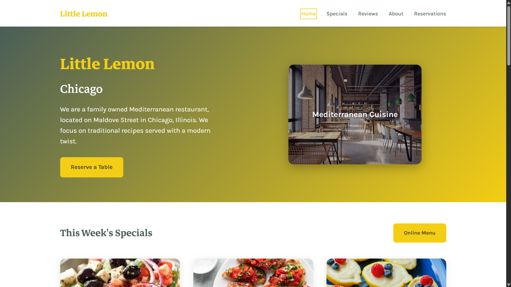
*Home - Main landing page with hero section and navigation*

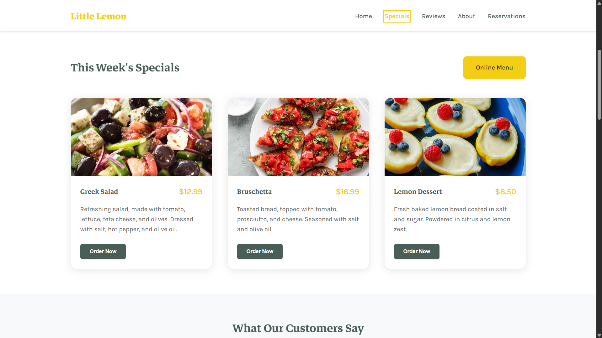
*Specials - Weekly menu items and featured dishes*

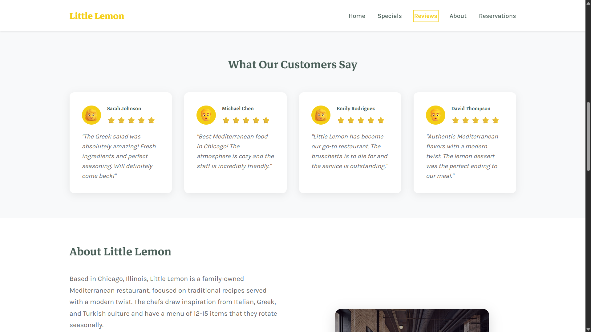
*Reviews - Customer testimonials and ratings*

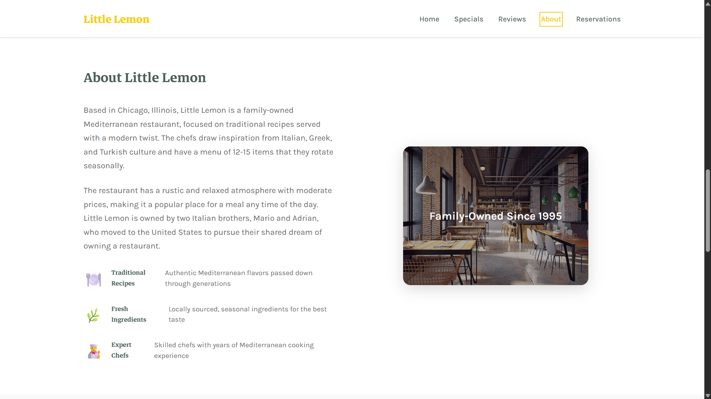
*About - Restaurant story and features*

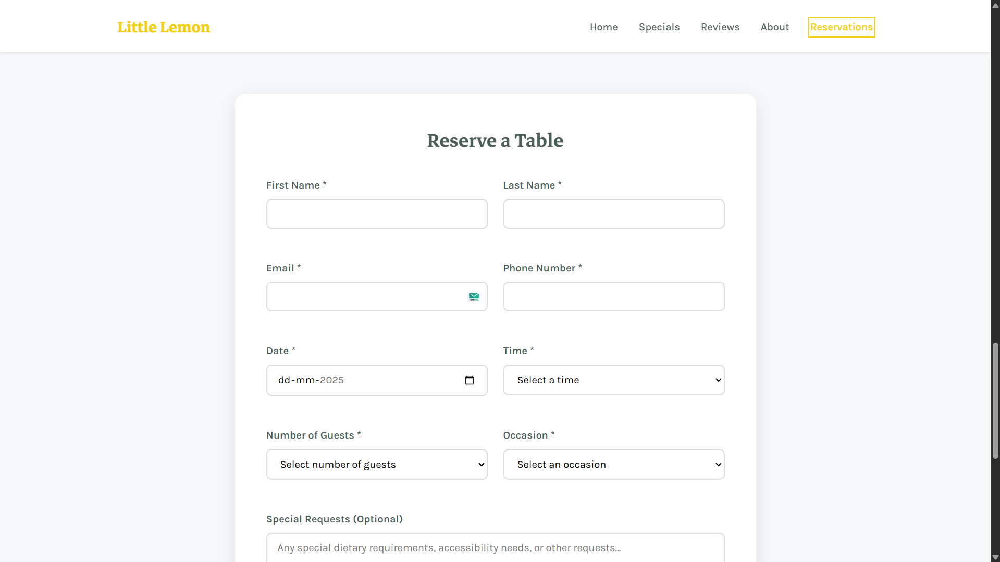
*Reservations - Booking form with validation*

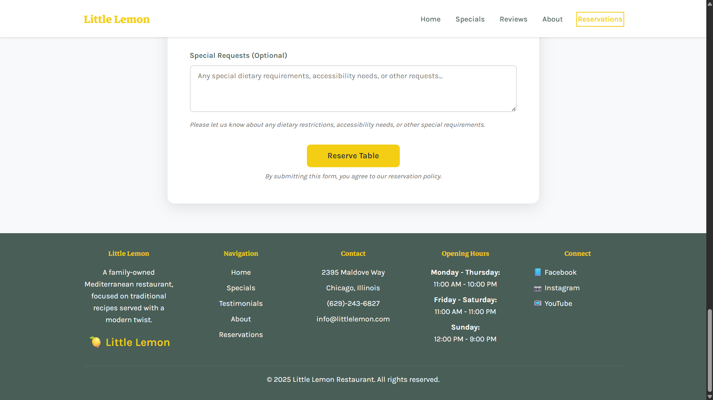
*Footer - Contact information, hours, and navigation*

### Mobile View

<table>
  <tr>
    <td align="center">
      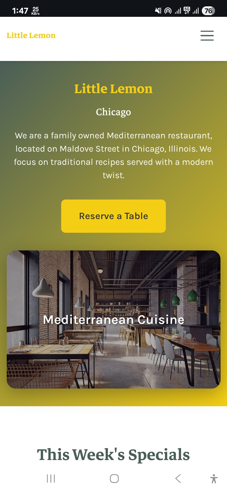
      <br><em>Home - Mobile navigation with hamburger menu</em>
    </td>
    <td align="center">
      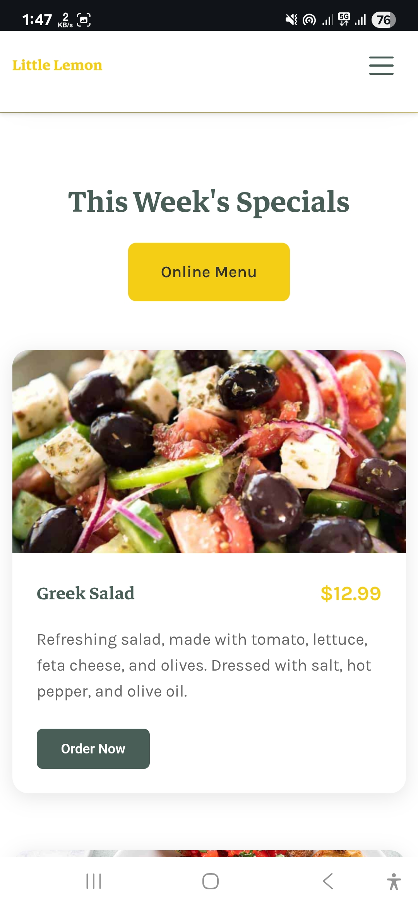
      <br><em>Specials - Mobile-optimized menu display</em>
    </td>
    <td align="center">
      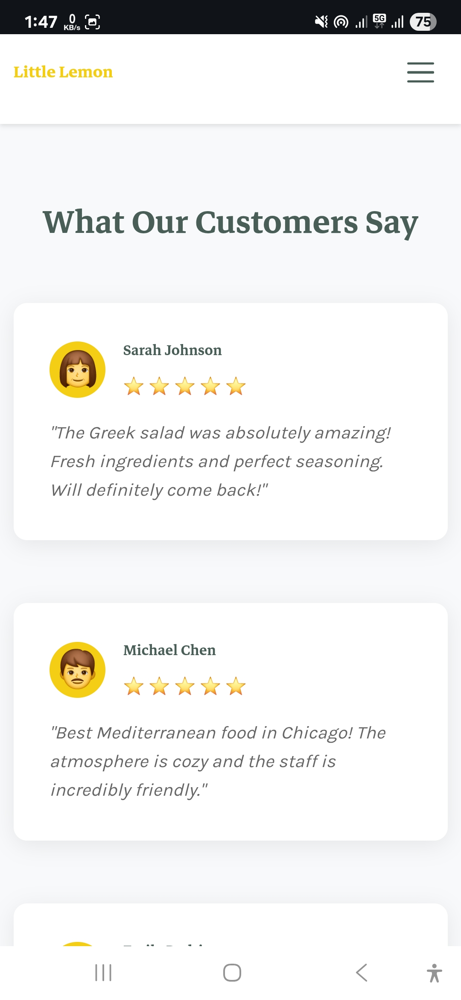
      <br><em>Reviews - Mobile testimonials layout</em>
    </td>
  </tr>
  <tr>
    <td align="center">
      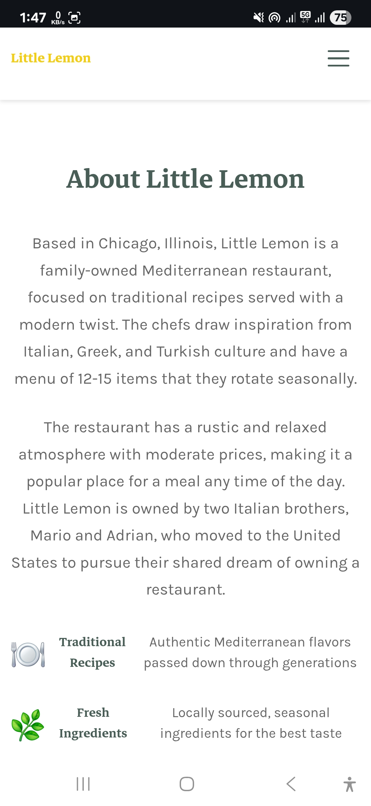
      <br><em>About - Mobile restaurant information</em>
    </td>
    <td align="center">
      
      <br><em>Reservations - Mobile booking form</em>
    </td>
    <td align="center">
      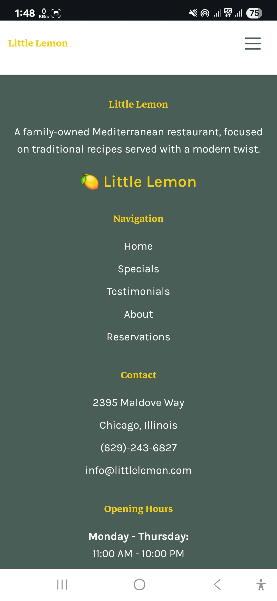
      <br><em>Footer - Mobile contact and navigation</em>
    </td>
  </tr>
</table>

## License

This project is licensed under the MIT License - see the LICENSE file for details.

---

**Little Lemon Restaurant** - A family-owned Mediterranean restaurant focused on traditional recipes served with a modern twist.

**Made by Durvesh Chavan**

